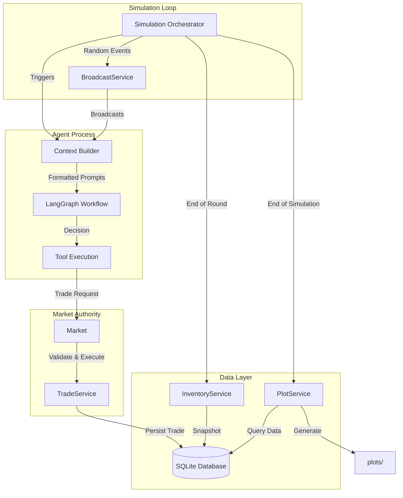

# Multi-Agent Economic Market Simulation

## Overview

This project is an autonomous multi-agent simulation designed to model complex economic interactions and emergent market behaviors. Unlike traditional economic models that assume rational actors, this simulation utilizes Large Language Models (LLMs) to power agents with distinct personalities, cognitive biases, and specific strategic objectives (e.g., hoarding, high-frequency trading, or stimulus injection).

The core challenge this project solves is the **simulation of "human" irrationality in financial markets**. By assigning specific psychological profiles (such as "Panic Seller," "Value Investor," or "Industrialist") to autonomous agents, the system observes how liquidity crises, asset bubbles, and wealth distribution organically emerge from individual micro-decisions.

### Key Features

- **LLM-Powered Agents**: Each agent uses GPT models for decision-making with unique personalities
- **Multi-Asset Economy**: Trade three asset types (Apple, Chip, Gold) with different base values
- **Survival Mechanics**: Agents must manage energy and cash to avoid death/bankruptcy
- **Real-Time Market**: Centralized order book with buy/sell offers and instant execution
- **Broadcast Events**: Random market news that influences agent decision-making
- **Analytics Dashboard**: Automated generation of 5 visualization plots after simulation
- **Configurable Personalities**: YAML-based agent configurations with custom biases and strategies

## Architecture

The system is built using Python and LangGraph, following a strictly modular architecture that separates agent cognition from simulation state management.

### Project Structure

```bash
├── agents/
│   ├── configs/            # Agent personality configurations (.yaml)
│   └── state.py            # LangGraph state definitions
├── config/
│   └── broadcast_events.yaml # Random market news events
├── experiment/             # Simulation outputs (Generated Plots & Logs)
├── models/                 # Core domain logic (Agent, Market entities)
├── schemas/                # Pydantic data structures (Offers, Trades, Messages)
├── services/               # Business logic (TradeService, PlotService, etc.)
├── simulation/             # Main orchestration loop
├── templates/              # Jinja2 System Prompts (The "Brain" of the agents)
├── utils/                  # Helper functions (Tools factory, rendering)
├── run_simulation.py       # Main entry point script
└── pyproject.toml          # Project dependencies
```

### Core Components

1. **The Agent (Cognitive Layer)**
   Each participant is an instance of the `Agent` class. The agent does not directly manipulate the simulation database. Instead, it perceives the world through a constructed context (rendered via Jinja2 templates) containing:
   - **Memory:** A persistent internal monologue that evolves every turn.
   - **Inventory:** Real-time read of cash and assets (Apple, Chip, Gold).
   - **Market Board:** Public active offers.
   - **Ticker Tape:** A log of recent trades to signal market temperature.
   - **Inbox:** Private notifications and broadcast events.

   The Agent's decision-making process is a state graph (LangGraph) consisting of:
   - **Analysis Node:** Reads the context and updates the internal monologue/strategy.
   - **Router:** Decides whether to act or wait.
   - **Action Node:** Executes tools (`create_offer`, `accept_offer`, `cancel_offer`) if applicable.

2. **The Market (Source of Truth)**
   The `Market` class acts as the central authority and clearinghouse. It holds the "God View" of the simulation.
   - **Validation:** Enforces logic (e.g., an agent cannot sell what they do not own).
   - **Execution:** Performs atomic transactions, transferring assets and cash between inventories.
   - **Trade Recording:** Persists all transactions via `TradeService` for historical analysis.

3. **The Simulation Loop (Orchestrator)**
   The `Simulation` class iterates through rounds, triggering each agent sequentially. It manages:
   - Agent turn order (randomized each round)
   - Energy drain and automatic apple consumption
   - Operational cost collection and bankruptcy handling
   - Inventory snapshots via `InventoryService`
   - Random market events via `BroadcastService`

4. **Broadcast Events (Market News)**
   The `BroadcastService` randomly selects events from `config/broadcast_events.yaml` to broadcast to all agents each round. These events simulate real-world market news and influence agent behavior:
   - **Disasters:** "Plague in the City" - suggests apple scarcity
   - **Market Rumors:** "Gold Rush", "Technology Boom" - hint at price changes
   - **Warnings:** "Economic Uncertainty", "Trade Tensions" - encourage caution
   - **News:** "Bountiful Harvest", "Chip Factory Delays" - supply information

5. **Analytics (Post-Simulation)**
   After simulation completes, `PlotService` generates 5 visualization charts:
   - Price trends per item over time
   - Net worth rankings (bump chart)
   - Energy-price correlation analysis
   - Transaction volume vs final cash
   - Asset composition breakdown per agent

### Data Flow Diagram



## How to Run

### Prerequisites

- Python 3.12+
- OpenAI API key

### Setup

1. Clone the repository:
   ```bash
   git clone <repository-url>
   cd marketplace-simulation
   ```

2. Install uv (Python package manager):
   ```bash
   pip install uv
   ```

3. Install project dependencies:
   ```bash
   uv sync
   ```

4. Create a `.env` file with your API key:
   ```bash
   echo "OPENAI_API_KEY=your-api-key-here" > .env
   ```

### Running the Simulation

```bash
uv run run_simulation.py --rounds 15
```

### Environment Variables

| Variable | Description | Required |
|----------|-------------|----------|
| `OPENAI_API_KEY` | OpenAI API key for LLM calls | Yes |

## Demo Guide

### Quick Start

1. Ensure your `.env` file contains a valid `OPENAI_API_KEY`
2. Run the simulation:
   ```bash
   uv run run_simulation.py --rounds 10
   ```
3. Watch the real-time trading logs in the console
4. After completion, check the `plots/` directory for analytics

### Command Options

| Option | Description | Default |
|--------|-------------|---------|
| `--rounds N` | Number of simulation rounds | 20 |

### Expected Output

**Console Logs:**
- Round headers with agent count
- Broadcast news events (market rumors, disasters, etc.)
- Agent turn status (inventory, energy)
- Trade executions (BUY/SELL offers, acceptances)
- Bankruptcy and death notifications
- Final simulation summary

**Generated Files:**
- `database.db` - SQLite database with trade history and inventory snapshots
- `plots/` directory containing:
  - `price_trends.png` - Average price per item over rounds
  - `net_worth_bump_chart.png` - Agent ranking changes over time
  - `energy_price_correlation.png` - System energy vs apple price
  - `volume_vs_cash.png` - Trading activity vs final wealth
  - `asset_composition.png` - Portfolio breakdown per agent

### Sample Log Output

```
============================================
        MARKETPLACE SIMULATION START
              10 agents loaded
============================================

──────────────────────────────────────────────────
───────────── ROUND 1/15 (10 agents) ─────────────
──────────────────────────────────────────────────
  NEWS: Markets Calm

  >> WARREN_BUFFET | $10000 | A:0 C:0 G:0 | E:30
     [SELL #1] WARREN_BUFFET offers 5 GOLD @ $1000.00
     TRADE: JORDAN_BELFORT bought 5 GOLD from WARREN_BUFFET @ $1000.00
```

## AI Assistance

This project was developed with AI assistance:

- **Claude Code**: Used to implement features where similar logic already existed in the codebase, add comprehensive documentation and docstrings throughout the code, and implement structured logging across all modules.

- **Google Gemini**: Used to generate all agent personality configuration files (`.yaml` files in `agents/configs/`), including their backgrounds, objectives, strategies, and behavioral biases.
